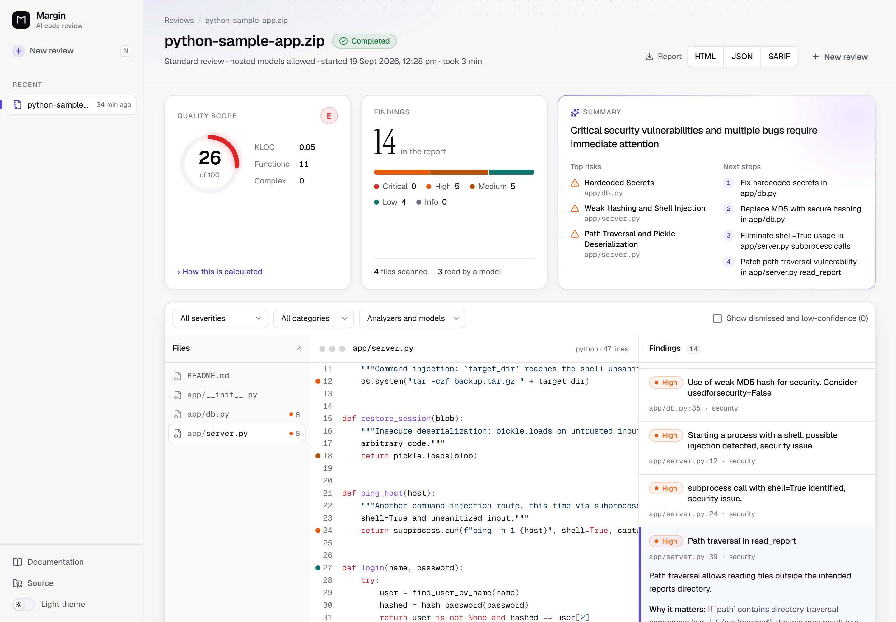
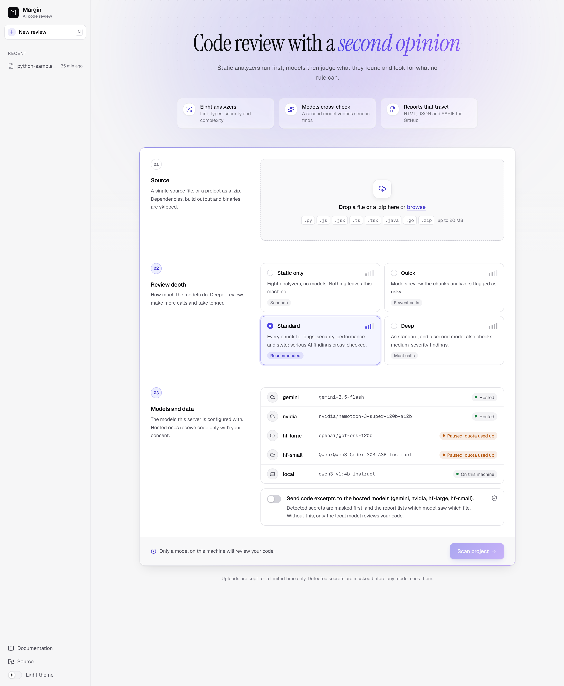

# Margin — AI Code Review Assistant

> Static analyzers find it. Models check it. You decide what changes.

Margin reviews a source file or a whole project by combining **static analysis** with **review by
hosted LLMs**. Analyzers find the issues a rule can express; models judge those findings and add the
ones no rule can, such as a discount applied twice or a cache that evicts its newest entry. Every AI
claim cites real lines and quotes real code, says which model made it and which confirmed it, and you
accept or reject it.

[](https://colab.research.google.com/github/kishorverse/code-review-assistant/blob/main/notebooks/margin_demo.ipynb)



## What it does

- **Bugs and security.** Common bug patterns and vulnerabilities, with CWE ids: injection, unsafe
  deserialization, path traversal, SSRF, weak cryptography and randomness, hardcoded secrets, and more.
- **Style.** Deviations from PEP 8 (Ruff), at the line length the project declares.
- **Optimization.** Performance and maintainability suggestions, backed by complexity metrics.
- **Grounded AI review.** Static findings go to the models as structured context; a model's answer is
  kept only if the lines and quoted code it cites exist. Serious AI findings are cross-checked by a
  model from another provider.
- **Built for free tiers.** A router spreads calls over Google Gemini, NVIDIA NIM, Hugging Face and a
  local model, stays under each one's limits, and falls back when a quota runs out or a provider is
  down.
- **Three ways to use it.** A web UI with live progress, a CLI, and a GitHub Action that publishes SARIF
  to code scanning. Reports in HTML, JSON and SARIF 2.1.0, with a quality score and its formula.
- **Private by default.** Code goes to hosted models only with explicit consent, detected secrets are
  masked first, nothing uploaded is ever executed, and uploads are deleted after 24 hours.

## How it works

```
 upload ─► ingest ─► preprocess ─► static analysis ─► LLM review ─► cross-check ─► summary ─► report
          safe unzip  tree-sitter,   Ruff · Bandit ·    chunk + static   second model  executive  score,
          and filters chunks ≤ 500   mypy · Radon ·     context, through on serious    summary    HTML,
                      lines          Vulture · Lizard · the router       AI findings              JSON,
                                     detect-secrets ·                                            SARIF
                                     Opengrep
```

Details: [design](docs/design.md), [static analysis](docs/static-analysis.md),
[LLM review](docs/review.md), [routing](docs/routing.md).

## Evaluation at a glance

On 32 modules written for the evaluation (55 labeled issues, 10 clean controls), with one reviewer model
(NVIDIA Nemotron) throughout:

| Configuration | Precision | Recall | F1 | Semantic issues found |
|---|---|---|---|---|
| Static analysis only | 0.94 | 0.53 | 0.68 | 0 of 26 |
| LLM review only | 0.82 | 0.73 | 0.77 | 22 of 26 |
| **Hybrid (Margin)** | **0.88** | **0.93** | **0.90** | 22 of 26 |

Static analysis finds every rule-shaped issue and none of the semantic ones; the model finds the
semantic ones; the hybrid keeps both. Of the models, Gemini 3.5 Flash was the most accurate and
gpt-oss-120b the fastest; a 4B local model found none of the semantic issues. The
[evaluation report](docs/evaluation.md) has the full results: model comparison, cross-model
verification, style accuracy, a routing simulation, latency, and the limitations.

Static scans take seconds (the 32-file project in about 4 s); hybrid scans take minutes on free tiers,
because each model answer takes seconds to tens of seconds.

## Quick start

### In the browser

Open the [Colab notebook](https://colab.research.google.com/github/kishorverse/code-review-assistant/blob/main/notebooks/margin_demo.ipynb):
it installs Margin, scans a project, reviews a file with models (or a mock provider without keys),
shows the report and recomputes the evaluation.

### On your machine

Requires [Python](https://www.python.org/downloads/) 3.11+, [uv](https://docs.astral.sh/uv/) and, for
the web UI, [Node.js](https://nodejs.org/) 22.12+.

```bash
git clone https://github.com/kishorverse/code-review-assistant.git
cd code-review-assistant/backend
cp .env.example .env        # add keys to enable LLM review; static analysis needs none
uv sync
uv run margin scan path/to/project
```

Web UI, in two terminals:

```bash
cd backend && uv run uvicorn app.main:create_app --factory      # API on :8000
cd frontend && npm ci && npm run dev                            # UI on http://localhost:5173
```

Drop a file or a `.zip`, choose a review depth, and decide whether code may go to hosted models. The
scan page shows the pipeline, each analyzer and each model's calls live, then becomes a workspace: files,
code with severity marks, and finding cards you can accept or reject. See [Web UI](docs/ui.md).



No keys? Start the backend with `LLM_MODE=mock` to try everything with canned model answers.

## Models and keys

| Provider | Setting | Get a key |
|---|---|---|
| NVIDIA NIM | `NVIDIA_API_KEY`, `NVIDIA_MODEL` | [build.nvidia.com](https://build.nvidia.com) |
| Google Gemini | `GEMINI_API_KEY`, `GEMINI_MODEL` | [Google AI Studio](https://aistudio.google.com/apikey) |
| Hugging Face | `HF_TOKEN`, `HF_MODEL_LARGE`, `HF_MODEL_SMALL` | [huggingface.co/settings/tokens](https://huggingface.co/settings/tokens) |
| Local (Ollama) | `LOCAL_MODEL`, `LOCAL_BASE_URL` | none; runs on your machine |

Keys go in `backend/.env` (every setting is documented in `.env.example`). A provider without its key
or model id is simply not used. `uv run python scripts/list_models.py` lists the models your keys can
reach. Which model does what, and why: [model selection](docs/model_selection.md). Rate limits and task
routing: `backend/config/providers.yaml`.

**Privacy.** Code goes to hosted providers only with `--allow-external` (CLI) or the consent box (UI);
otherwise only a local model or static analysis runs. Secrets that detect-secrets finds are masked
before any prompt, and the report lists which provider saw which file. Check each provider's terms
before sending code you may not share.

## Command line

```bash
cd backend
uv run margin scan src                                   # static analysis, table of findings
uv run margin scan src --depth standard --allow-external # add LLM review by hosted models
uv run margin scan src --depth quick                     # LLM review by a local model only
uv run margin scan project.zip --format html --output report.html
uv run margin scan src --format sarif --output margin.sarif
uv run margin scan . --exclude tests/fixtures --fail-on high
```

`--depth` sets how much the models do: `quick` reviews risky chunks, `standard` reviews every chunk for
bugs, security, performance and style and cross-checks high and critical AI findings, and `deep` also
cross-checks medium ones. AI findings below `--min-confidence` (0.6) are left out of the report. Exit
codes: `0` success, `1` a finding reached `--fail-on`, `2` the input was rejected, `3` the provider
configuration is invalid.

## GitHub Action

[`.github/workflows/margin-review.yml`](.github/workflows/margin-review.yml) runs Margin on this
repository on every push and pull request and publishes the findings to **Security → Code scanning**.
Copy it into another repository to do the same there. Static analysis needs no secrets; to add LLM
review, set the repository variable `MARGIN_DEPTH` and the provider keys as secrets.

## Web API

`POST /api/scans` with a file, then follow `GET /api/scans/{id}/events` (server-sent events), and fetch
findings, files and reports; interactive docs at http://127.0.0.1:8000/docs. See the
[API reference](docs/api.md).

## Development

```
backend/            FastAPI service, pipeline, CLI (app/), evaluation harness (evaluation/), tests
frontend/           React + TypeScript web UI
eval/               evaluation dataset and results
notebooks/          Colab demo
docs/               design and engineering documentation
.github/workflows/  CI and the Margin review action
```

The same checks CI runs on every pull request:

```bash
cd backend && uv run ruff check . && uv run ruff format --check . && uv run mypy && uv run pytest --cov
cd frontend && npm run format:check && npm run lint && npm run typecheck && npm test && npm run build
```

Install the pre-commit hooks once with `cd backend && uv run pre-commit install`.
Conventions are in [coding rules](docs/coding-rules.md) and [tech stack](docs/tech-stack.md).

## Limitations and future work

- **Python first.** JavaScript, TypeScript, Java and Go get parsing, complexity, secret scanning, the
  custom Opengrep rules and LLM review, but not the full set of Python analyzers.
- **One chunk at a time.** Models see a chunk with its imports and enclosing signatures, not the whole
  project, so issues that span files can be missed.
- **Free tiers shape results.** Quotas run out and providers go down; Margin keeps going with fallbacks,
  but a scan that fell back to the local model is a shallower review (the report shows who reviewed
  what).
- **The evaluation is small and synthetic.** 55 labels in 32 files, labeled by one author; public
  datasets (BugsInPy, CVEfixes) and real repositories are the next step.
- **Not yet built:** generating and validating fixes as diffs, PDF reports, learning from reviewers'
  decisions, a VS Code extension, Docker Compose, and end-to-end browser tests.

## Documentation

- [Design](docs/design.md) · [Tech stack](docs/tech-stack.md) · [Coding rules](docs/coding-rules.md)
- [Static analysis](docs/static-analysis.md) · [LLM review](docs/review.md) · [Routing](docs/routing.md)
  · [Model selection](docs/model_selection.md)
- [Web API](docs/api.md) · [Web UI](docs/ui.md)
- [Evaluation](docs/evaluation.md) · [Evaluation data](eval/README.md)
- [Licenses](docs/licenses.md) · [Requirements coverage](docs/requirements.md): each item of the brief, and where it is met

## License

[MIT](LICENSE)
